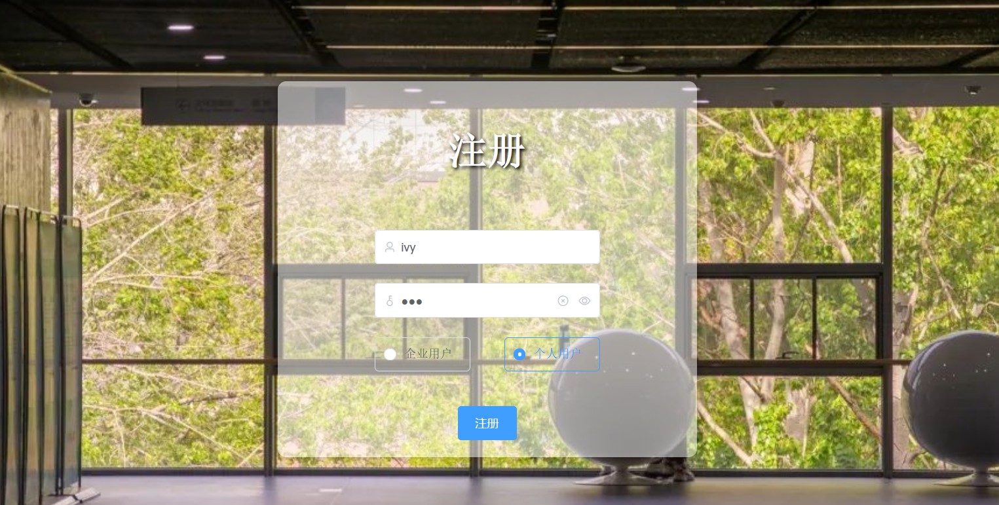
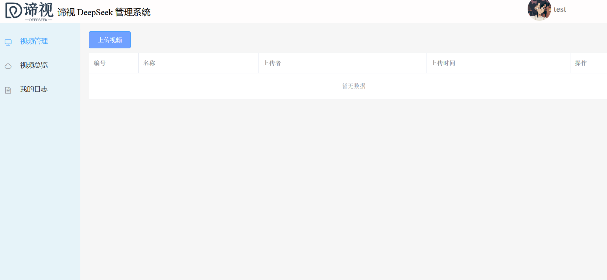
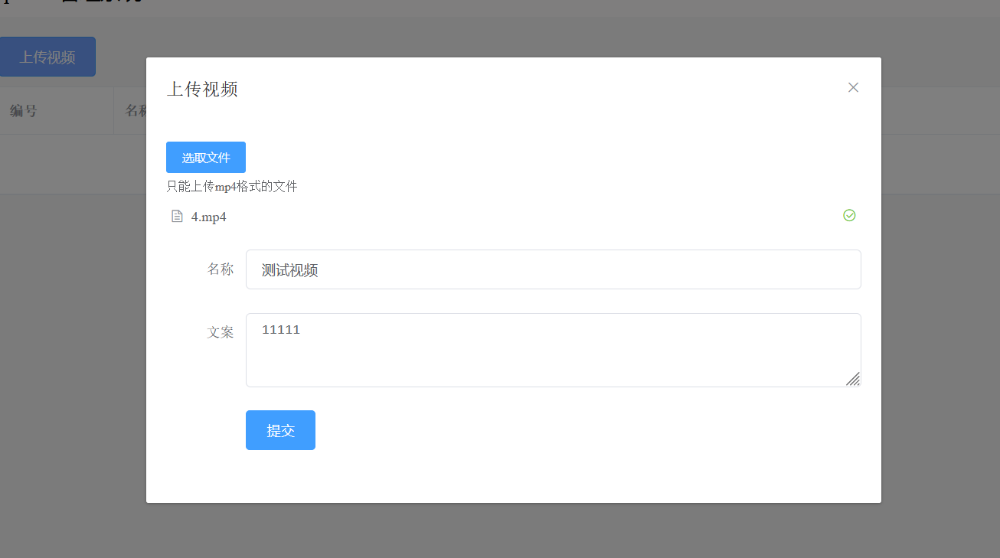
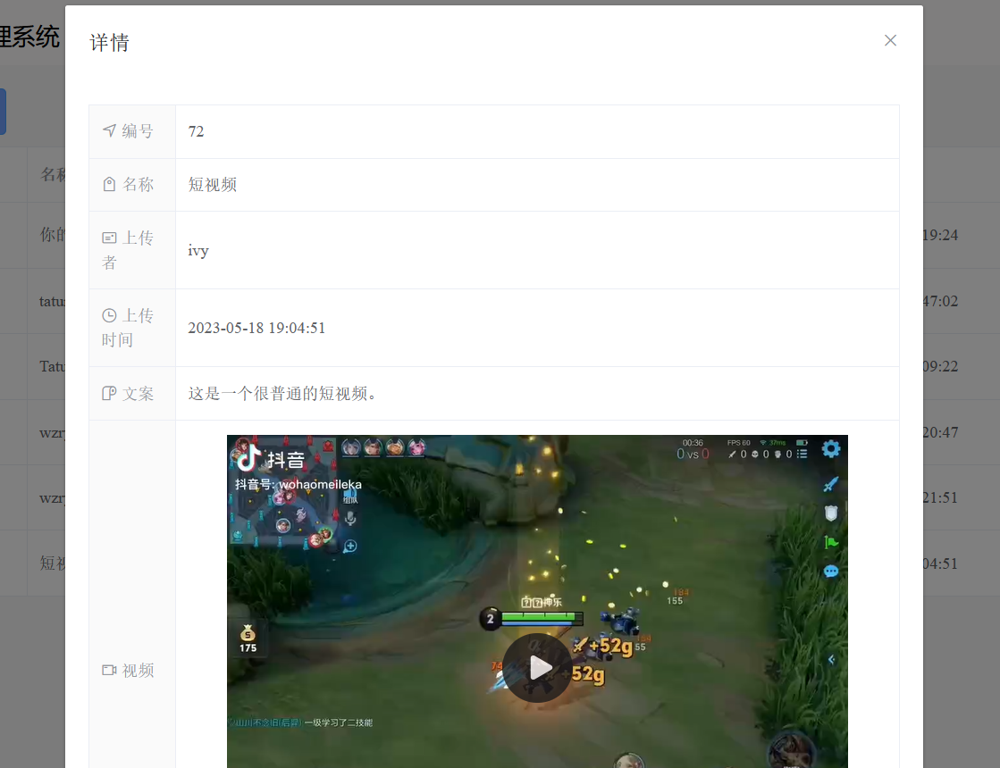
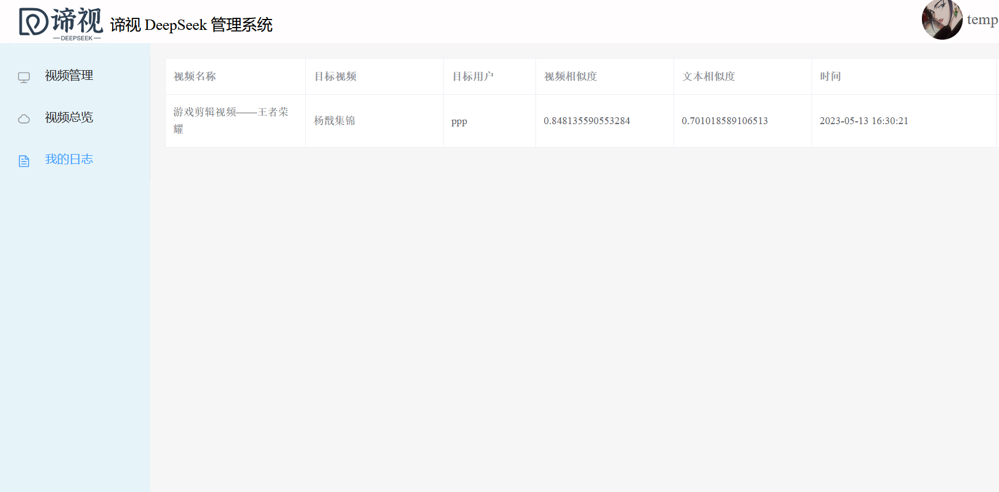
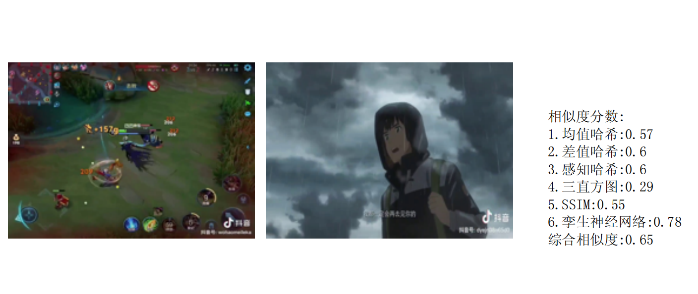
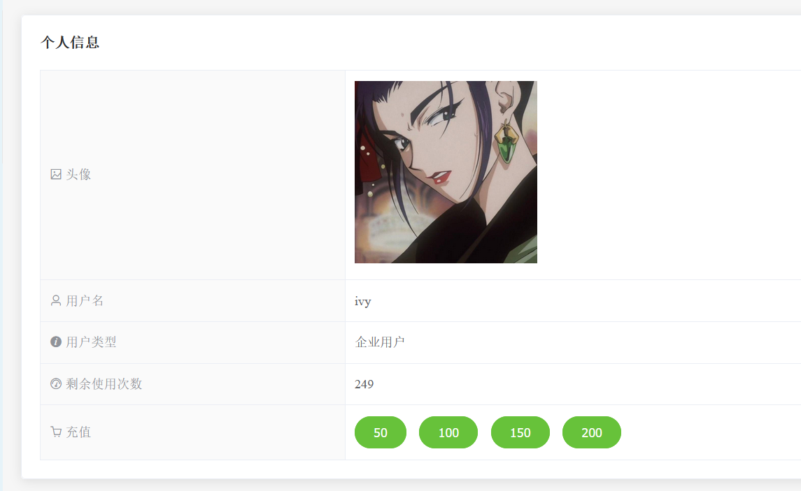

# DeepSeek 谛视

基于多种哈希算法和孪生神经网络的短视频相似度检测系统

文本相似度检测算法使用Jaccrad，余弦相似度及Dice，最终结果为三者取平均值

视频相似度检测即为遍历关键帧对比，使用均值哈希，差值哈希，感知哈希，三直方图及SSIM指标，若这五个指标中有四个及以上大于阈值0.55，则调用神经网络进行进一步对比，最终分数为0.1*(前五个算法之和) + 神经网络/100

## 开发框架

- Vue3

- Flask

## 项目功能

### 登录、注册

### 视频管理与上传

### 视频总览

### 日志与报告下载

### 个人信息

## 项目搭建与运行

### 前端

node.js版本v14.17.1

frontend目录下npm i && npm run serve

生产环境搭建命令为npm run build，文件在dist目录下

### 后端

Python版本(Anaconda)3.7

backend目录下pip install -r requirements

数据库建议清空，测试用户名ivy，密码ivy

## 鸣谢

[@Bubbliiiing](https://github.com/bubbliiiing)

开源的[Siamese神经网络项目](https://github.com/bubbliiiing/Siamese-keras)